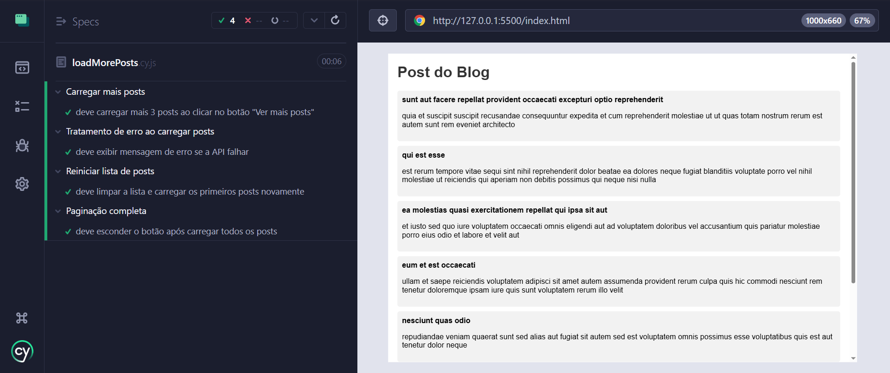

# 📰 Paginação de Posts com Cypress + API

Este projeto simula um blog com posts carregados de forma paginada a partir de uma API pública (`JSONPlaceholder`).

O foco foi aplicar **conceitos reais de front-end com JavaScript puro** e **automatizar testes E2E com Cypress**, simulando o comportamento de um app usado em produção.

---

## 🚀 Funcionalidades

- Consumo de dados da API `https://jsonplaceholder.typicode.com/posts`
- Paginação real: exibição de 3 posts por vez
- Mensagem de carregamento ("Carregando...") enquanto busca os dados
- Tratamento de erro com mensagem de falha amigável
- Ocultação automática do botão "Ver mais" ao fim da lista
- Botão "Reiniciar Lista" para resetar os posts e reiniciar a visualização
- Estilização básica com HTML e CSS

---

## 🧪 Testes Automatizados com Cypress

Os testes foram escritos com **Cypress**, cobrindo os principais cenários de uso da aplicação: 

- ✅ Primeira carga de posts
- ✅ Carregamento progressivo (paginação)
- ✅ Ocultação do botão após último post
- ✅ Reset da lista com botão
- ✅ Simulação de erro da API (status 500)

> 📍 Os testes estão na pasta `cypress/e2e`.

---

## 📸 Testes em execução

> 

---

## 🛠️ Tecnologias 

- **HTML, CSS e JavScript (Vanilla JS)**
- **Cypress** para testes E2E
- **API JSONPlaceholder** (fake REST API gratuita)

---

## 🗂️ Como rodar o projeto localmente

1. Clone o repositório:
```bash
git clone https://github.com/vanvilas/qa-portfolio.git
cd cypress-api-posts
```
2. Instale as dependências:
```bash
npm install
```
3. Inicie um servidor local para abrir o `index.html`. Ex:
```bash
npx live-server
```
4. Rode os testes:
```bash
npx cypress open
```

---

👩‍💻 Sobre mim

Desenvolvido por Vanessa Vilas Boas — apaixonada por tecnologia e qualidade de software.

📌 Em transição de carreira, com foco em QA (Testes Automatizados) e conhecimentos sólidos em desenvolvimento front-end.
[LinkedIn](https://www.linkedin.com/in/vanessa-vilas-boas/)